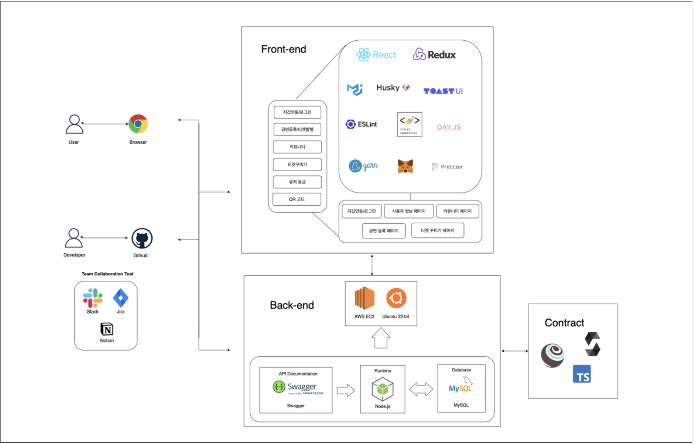
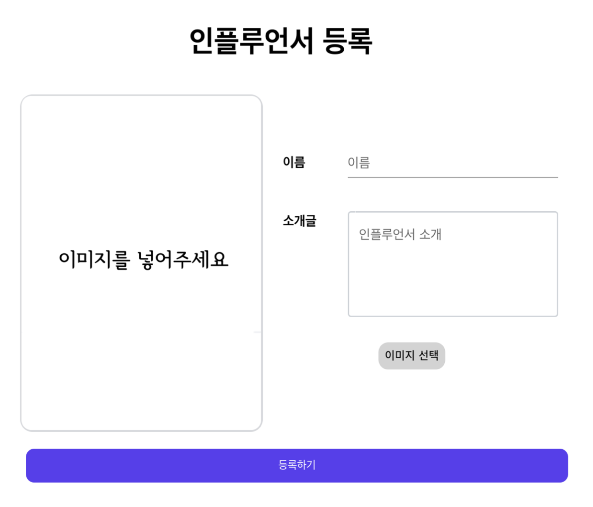
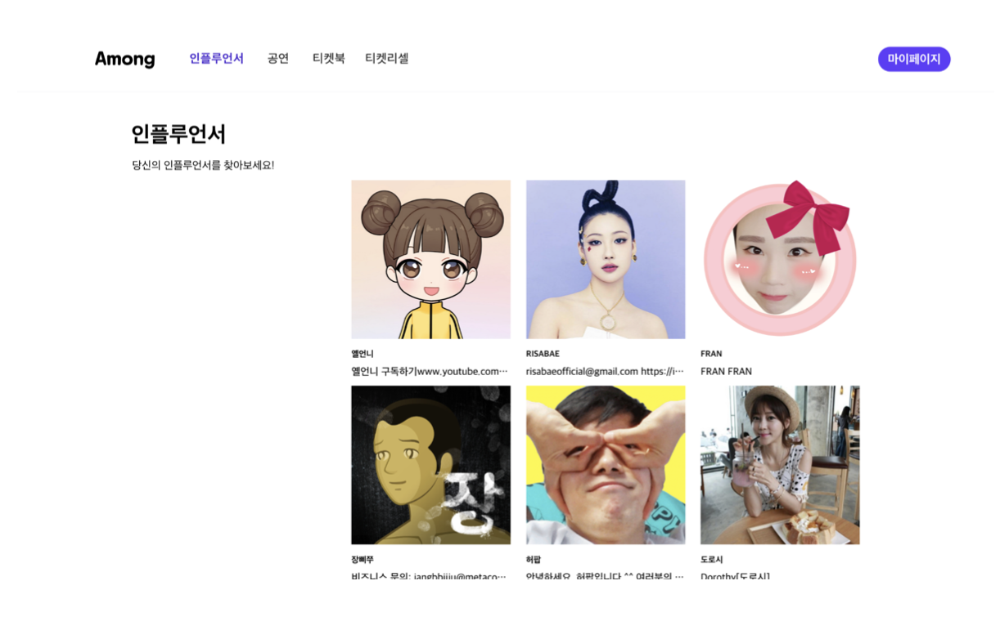
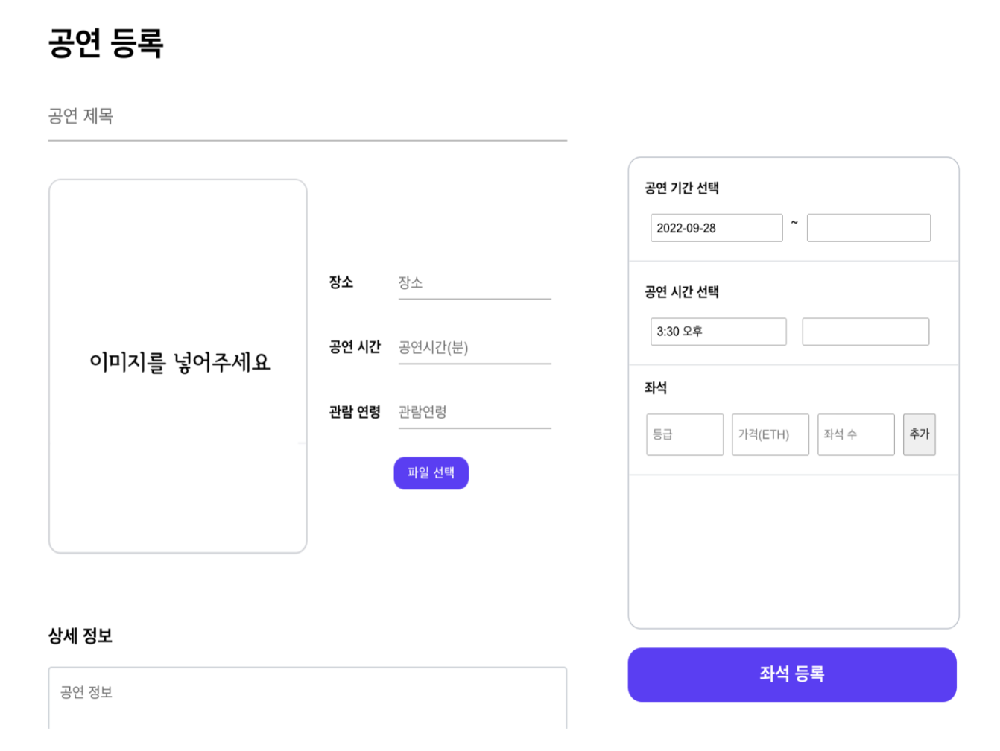
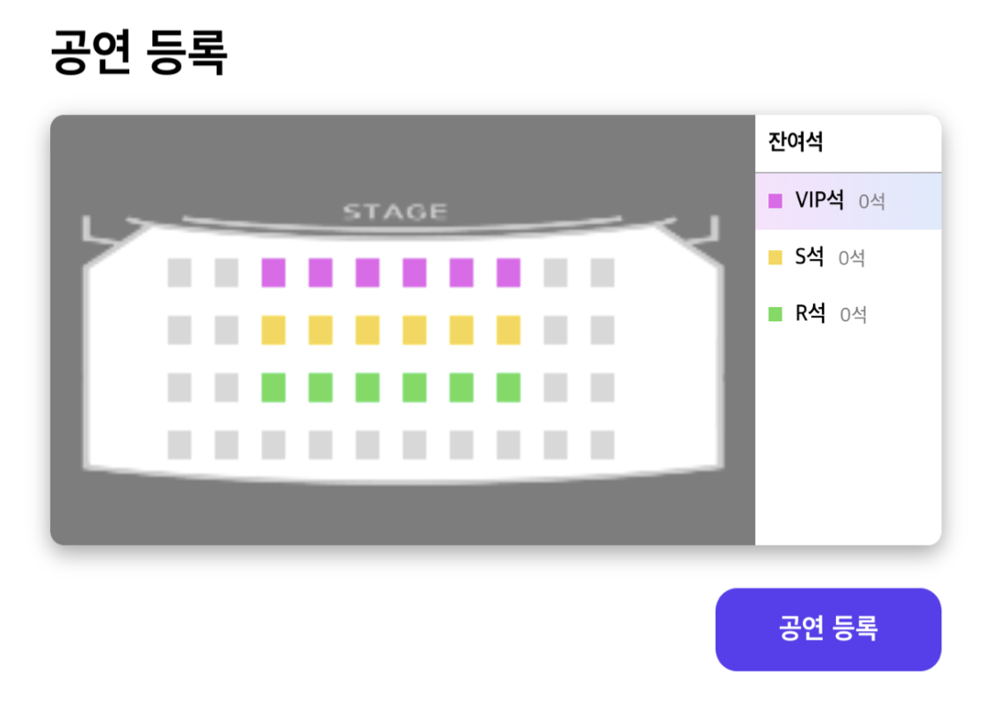
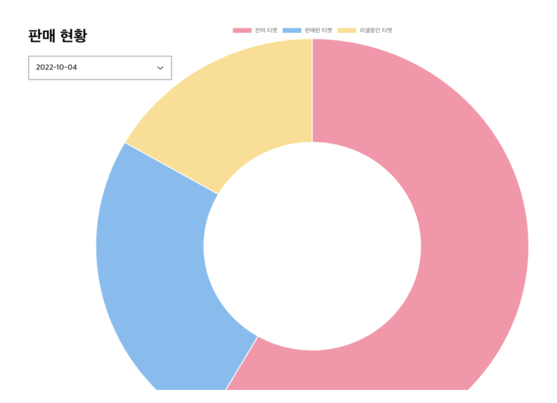
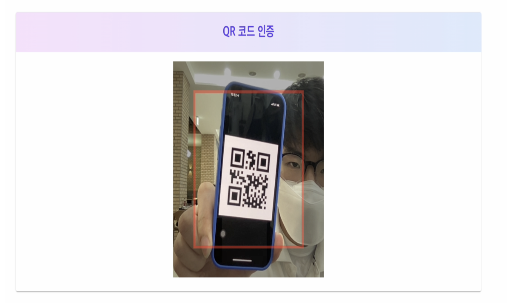
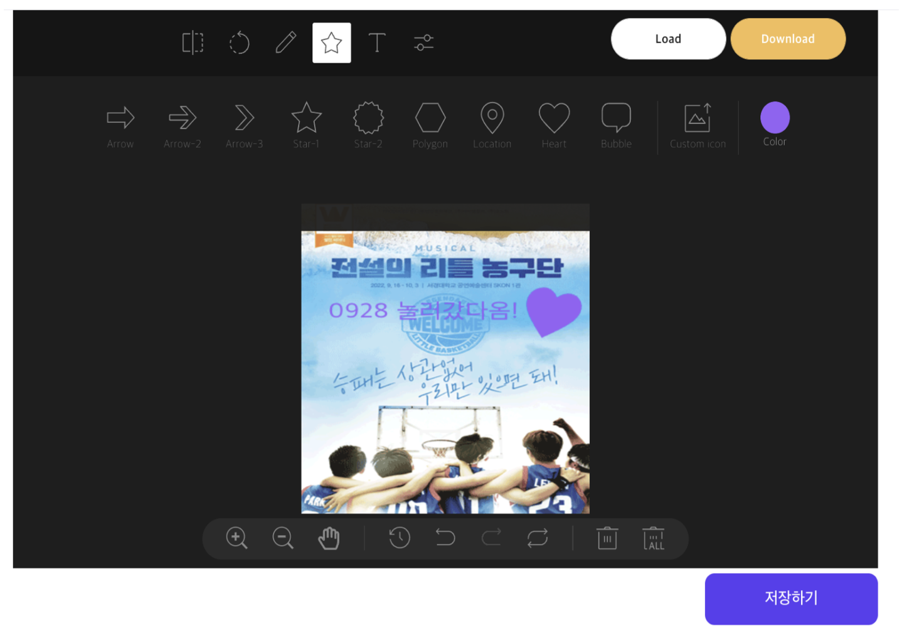
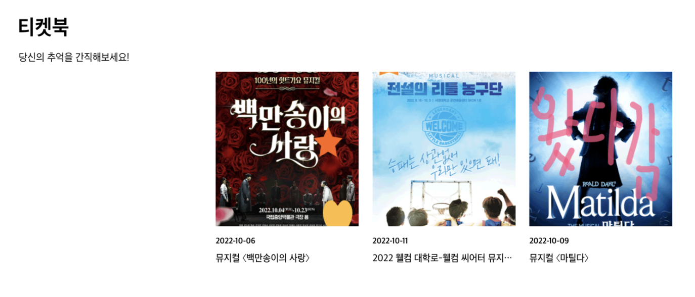
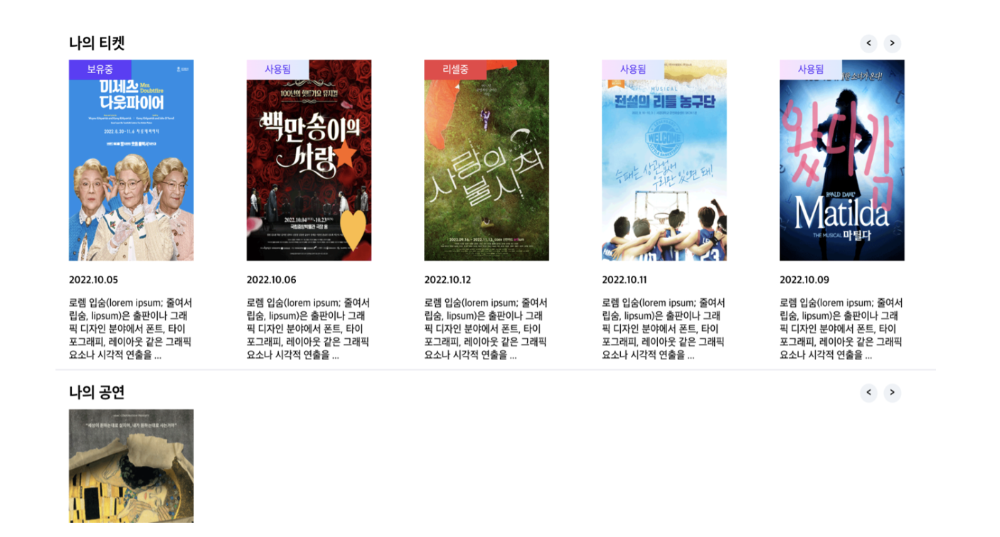

# 블록 체인 기반 팬덤 커뮤니티 플랫폼
<div align="center">
  

</div>

## 목차
1. [**서비스 소개**](#1)
2. [**목적**](#2)
3. [**팀 소개**](#3)
4. [**시스템 아키텍쳐**](#4)
5. [**구성도**](#5)
6. [**소개 및 시연 영상**](#6)
7. [**사용법**](#7)


<div id="1"></div>

## 1. 서비스 소개
**Among**은 인플루언서가 공연 티켓 발행 서비스입니다.  
추가적으로 인플루언서와 팬들 간에 소통을 위한 커뮤니티 서비스도 제공하고
사용된 티켓은 직접 꾸며 추억으로 간직 할 수 있습니다.

<div id="2"></div>

## 2. 목적
+ 커뮤니티 기능을 통해 인플루언서와 팬 간에 쌍방향 소통이 가능하여지도록 한다.
+ 기준에 따른 등급제가 존재하고, 등급에 따라 활동 참여에 제한이 생긴다.
+ 인플루언서에게 행사 진행을 위한 티켓 발행 서비스를 제공한다.
+ 행사 참여 인증과정(QR코드 인증)을 거친 후 토큰을 발행한다.
+ 일정 개수의 토큰 달성 시 등급이 올라가는 등급 상승 시스템을 도입한다.
+ 인플루언서가 행사를 등록하고 팬덤은 티켓을 구매, 리셀 할 수 있는 플랫폼을 구축한다.

<div id="3"></div>


## 3. 팀 소개
|이름|이메일|역할|
|:---:|:---:|:---:|
|강태훈 |sls97117@gmail.com|SQL 기반인 Mysql DB(database), Express.js 를 사용하여 API를 개발, Swagger  프레임워크를 사용하여 API를 문서화|
|김동영|ehddud1006@pusan.ac.kr|UI 디자인 설계, 플랫폼 UI/UX 구축|
|최정혜|ppllhm.0@gmail.com|개발 환경 세팅, 자동화 시스템 설정, 스마트 컨트랙트 개발|

<div id="4"></div>

## 4. 시스템 아키텍처


<div id="5"></div>

## 5. 구성도
### 5.1 인플루언서 페이지  
회원은 누구나 인플루언서를 등록하여, 인플루언서로 활동할 수 있다.  

<div align="center">[그림] 인플루언서 페이지</div>

팬들은 자신의 인플루언서를 찾아 커뮤니티를 이용할 수 있다.

### 5.2 커뮤니티 페이지  

<div align="center">[그림] 인플루언서 페이지</div>

같은 인플루언서를 좋아하는 팬들은 커뮤니티에서 서로 이야기를 주고받을 수 있 다.또한 인플루언서가 남긴 피드를 읽을 수 있다.

### 5.3 공연 등록 페이지    
인플루언서는 자신의 공연을 등록할 수 있다.   

<div align="center">[그림] 공연 등록 페이지</div>

인플루언서는 좌석의 수량을 선택하고 배치를 할 수 있다.

### 5.4 공연 티켓 판매현황 페이지  

<div align="center">[그림] 공연 등록 페이지</div>

인플루언서는 자신의 공연에 대한 판매 현황의 정보를 시각화된 데이터를 통해 알 수 있다.  

<div align="center">[그림] 공연 티켓 판매현황 페이지</div>

### 5.5 공연 티켓 사용 페이지  
티켓이 생성될 때 발급된 QR 코드를 리더기에 인식시켜 티켓을 사용한다.  

<div align="center">[그림] 공연 티켓 사용 페이지</div>

### 5.6 티켓북 페이지  
팬들은 사용한 티켓에 대하여 커스텀 꾸미기를 할 수 있다.  


<div align="center">[그림] 티켓북 페이지</div>

티켓북에서 자신이 커스텀한 티켓들을 소장할 수 있다.  
  

<div align="center">[그림] 티켓북 페이지</div>

### 5.7 마이페이지  
마이페이지에서 자신이 보유한 티켓과 등록한 공연에 대한 정보를 얻을 수 있다.

<div align="center">[그림] 마이 페이지</div>

<div id="6"></div>

## 6. 소개 및 시연 영상

<div id="7"></div>

## 7. 사용법

### 소프트웨어 요구사항
|   이름    |버전|내용|
|:-------:|:---:|:---:|
| eslint  |v7.32|개발 규칙 적용|
| vscode  |v1.6|개발 IDE|
|   git   |v2.36|분산 버전 관리 시스템|
| node.js |v14.19.0|런타임|
|  mysql  |v8.0.29|데이터베이스|


### Frontend
```bash
# path 이동
cd ./packages/frontend

# 패키지 설치
yarn

# 실행
yarn start

```
### Backend
```bash
# path 이동
cd ./packages/backend

# 패키지 설치
yarn

# Mysql DB 추가
yarn sequelize db:create

# swagger-ui 파일 생성
node ./swagger/swagger.js

# 실행
yarn dev

```
